# USER MANUAL

## Convert files

### Convert .mic1-files

In order that the synthesis tools can read the .mic1- and .ijvm-files, they must be converted into .mem with a certain structure.

To convert the .mic1-file the program mic1tomem.py has to executed with the following command in the terminal:

```
$ python3 PATH/mic1tomem.py PATHOFFILE/FILENAME.mic1
```

This will convert the .mic1-file into a .mem-file and store it in the same folder as the .mic1-file from it was read.

### Convert .ijvm-files

To convert the .ijvm-file the program ijvmtomem.py has to executed with the following command in the terminal:

```
$ python3 PATH/ijvmtomem.py PATHOFFILE/FILENAME.ijvm
```

This will convert the .ijvm-file into a .mem-file and create a define file, which has the name *defines\_FILENAME.sv.* The files will be store in the same folder as the .ijvm-file from it was read. Because this file has an area, where a certain stack size will be reserved, the additional to reserve stack size can be chosen by add the following parser at the end of the entered command:

```
$ python3 PATH/ijvmtomem.py PATHOFFILE/FILENAME.ijvm -st 16
```

The entered number at the end are adding the according words to the file. By default it is 64. Instead of *-st* also *--stacksize* can be entered.

## MIC1 Basys3 Implementation

To deploy the MIC1 on the Basys3 board the file top\_level\_basys3.xpr in the top-level subfolder must first be opened in Vivado.

### Elaboration & Constraints

Click on "*Open Elaborated Design*" in the left sidebar then switch to "I/O Planning" in the top right corner.

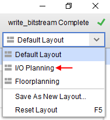

Then select "*I/O Ports*" in the lower section of the window.

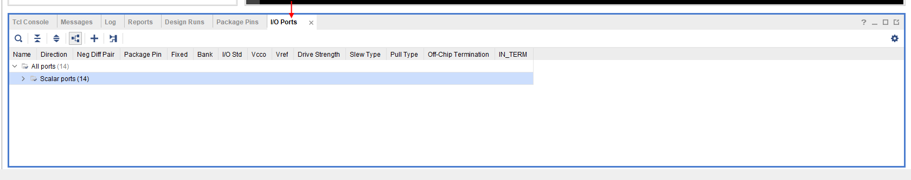

The I/O pins have to be assigned as follows:

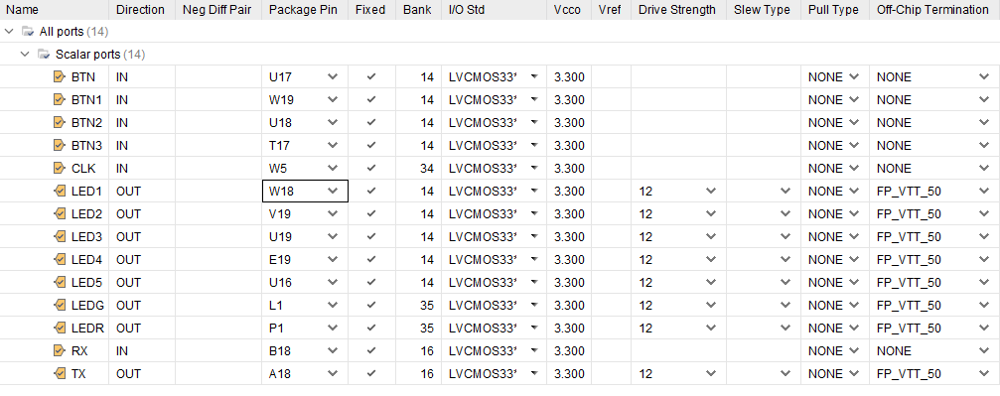

After a click on the Save button, the following dialog appears:

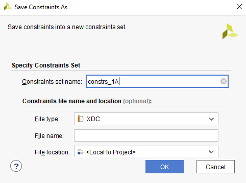

### Synthesis, Implementation & Bitstream-Generation

After elaboration and pin assignment are completed, click on "*Run Synthesis*" in the left sidebar. When synthesis is complete, the following dialog box appears. Select "*Run Implementation*" if it is not already selected:

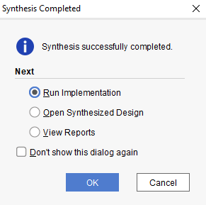

After completing the implementation, select „*Generate Bitstream*“ in the dialog box if it is not already selected:

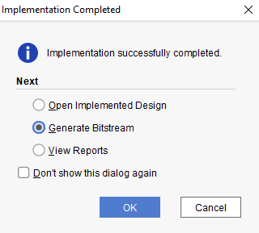

Once the bitstream generation is complete, select "*Open Hardware Manager*" in the following dialog box:


### Hardware Manager

After starting the Hardware Manager, right-click on "*Program and Debug*" in the left sidebar to get to the Bitstream Settings.

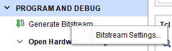

In the Bitstream Settings place a check mark at "*-bin\_file\**".

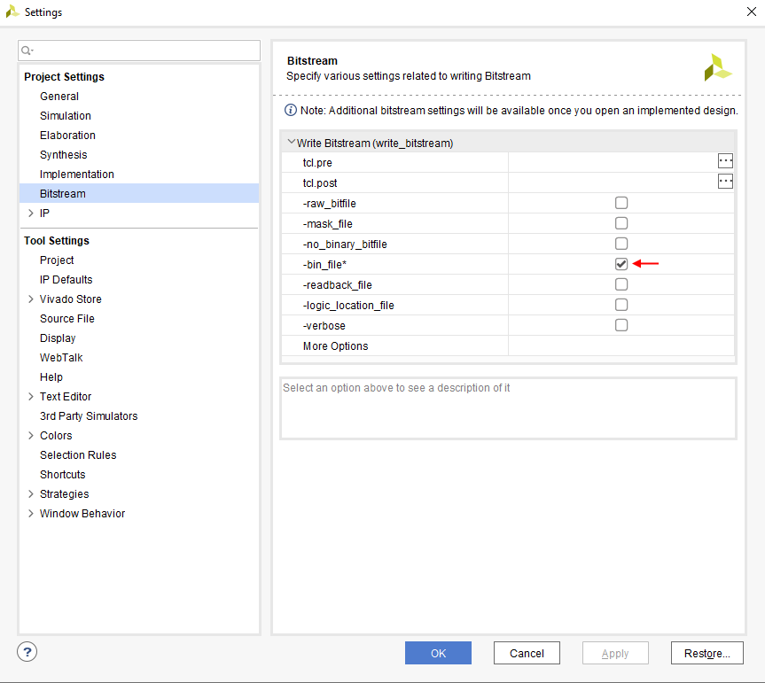

Now connect the Basys3 board to the computer and select "*Open Target*" in the main window then " *Auto Connect*" in the following menu.

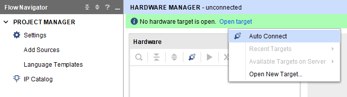

Now the Configuration Memory Devices Properties have to be adjusted in the hardware window. Right-click on "*s25fl032p-spi-x1\_x2\_x4*" and select the corresponding option in the menu. Then enter the path to the bin file under "*Programming File*" as follows:

„*STORAGE LOCATION/mic-1-project/verilog/top-level/top\_level\_basys3.runs/impl\_1/mic1\_basys3.bin*“


Before the Basys3 can be programmed it must be checked if the Boot Mode Jumper is set to "*SPI Flash*" position, so that the FPGA is configured automatically at startup:

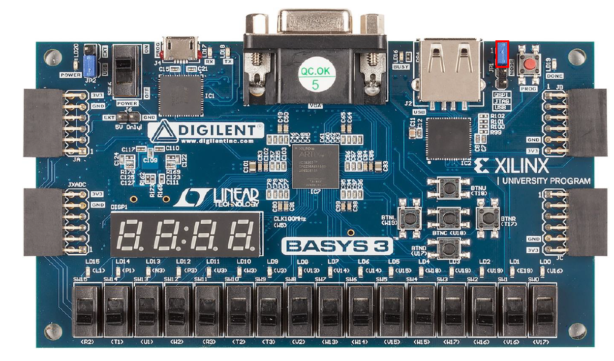

Once these preparations are completed, the device can be programmed:

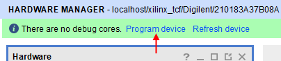

When programming is complete, the Done-, Power-, and LDI4-LEDs should be lit, and the 7-segment display should also be weakly illuminated.

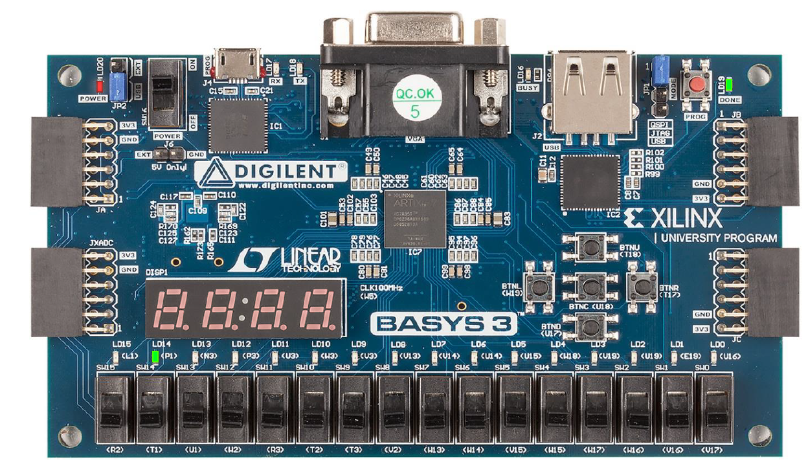

## Connection via UART to the FPGA

To communicate with the FPGA you need a terminal program for serial communication. In this case hTerm is used.

1\.       Download hTerm from the following website:\
<https://www.der-hammer.info/pages/terminal.html>

2\.       Unpack the zip archive and start **hTerm**.

3\.       First of all you need configurate the communicator right. The following changes need to be made:

* Select the COM port to which the FPGA is connected.
* Select the Baud rate 9600, 8 data bits, 1 stop bit and no parity bit.
* Select Newline at LF and Send on enter LF.

4\.       After you have made the changes, click **Connect**.

5\.       Now you can communicate with the FPGA trough the input control.\
The messages from the FPGA will be displayed in the "Received Data" Tab.

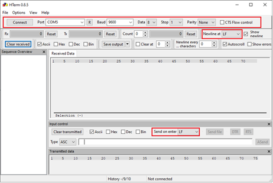